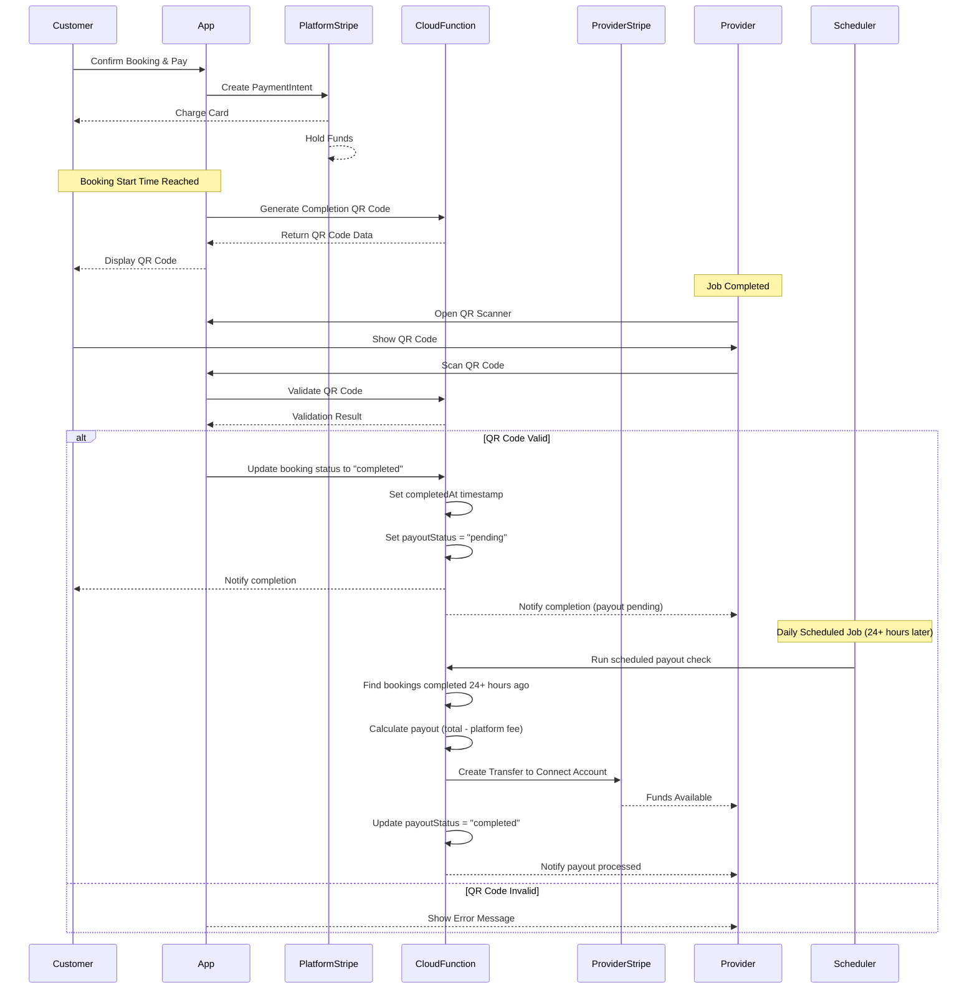

# Stripe Connect Provider Payout System

## Overview

Implement a complete escrow-style payment system where:

1. Customer pays → funds go to platform's Stripe account (already working)
2. When booking start time is reached → customer receives completion QR code
3. Provider scans QR code when job is done → booking marked as completed
4. Funds are held for 24-48 hours after completion (dispute resolution window)
5. Daily scheduled function processes payouts → transfers funds to provider's Stripe Connect account (minus platform fee) for bookings completed 24+ hours ago

**Important:**

- Bookings only have a start time (no end time). Jobs can vary in duration from hours to days, so QR codes remain valid for a configurable period (default: 7 days) after the booking start time.
- Funds are held for 24-48 hours after completion before payout to provide a dispute resolution window.

## Architecture Flow



## Implementation Components

### 1. Provider Stripe Connect Onboarding

**Files to create/modify:**

- `lib/models/user_model.dart` - Add `stripeConnectAccountId` field
- `lib/services/stripe_connect_service.dart` - New service for Connect operations
- `lib/views/screens/provider/stripe_connect_onboarding_screen.dart` - New onboarding UI
- `Home-Cleaning-Cloud-Functions/functions/src/index.ts` - Add Connect account creation function

**Details:**

- Create Cloud Function `createStripeConnectAccount` that creates a Connect account for providers
- Store `stripeConnectAccountId` in user document
- Add onboarding flow in provider profile/settings

### 2. QR Code-Based Booking Completion

**Files to create/modify:**

- `lib/services/qr_code_service.dart` - New service for QR code generation and validation
- `lib/controllers/booking_completion_controller.dart` - New controller for completion flow
- `lib/views/screens/bookings/completion_qr_screen.dart` - Customer screen to display QR code
- `lib/views/screens/bookings/scan_completion_qr_screen.dart` - Provider screen to scan QR code
- `lib/controllers/bookings_controller.dart` - Add `completeBookingWithQR()` method
- `lib/views/widgets/bookings/booking_card.dart` - Add "Scan QR to Complete" button for providers
- `lib/views/screens/bookings/booking_details_screen.dart` - Add QR code display/scan actions
- `Home-Cleaning-Cloud-Functions/functions/src/index.ts` - Add QR code validation function

**Details:**

- **QR Code Generation:**
  - Generate QR code when booking start time is reached (or within 15 minutes before)
  - QR code contains: `bookingId`, `verificationToken` (secure random string), `timestamp`
  - Store verification token in Firestore: `bookings/{bookingId}/completionToken`
  - Token expires after booking start time + 7 days (configurable, allows for jobs that may take days)
  - QR code only visible to customer for accepted bookings
  - Note: There is no booking end time - jobs can vary in duration (hours to days)

- **QR Code Display (Customer):**
  - Show QR code in booking details when:
    - Booking status is `accepted`
    - Current time >= booking start time (or 15 minutes before)
    - QR code not yet scanned
  - Display countdown timer if before start time
  - Show clear instructions: "Show this QR code to your service provider when the job is complete"
  - Include booking details (service name, provider name) for context

- **QR Code Scanner (Provider):**
  - Accessible from booking details or booking card for accepted bookings
  - Use `mobile_scanner` or `qr_code_scanner` package
  - Validate scanned QR code:
    - Verify booking ID matches
    - Verify verification token matches stored token
    - Verify token hasn't expired
    - Verify booking belongs to provider
    - Verify booking is in `accepted` status
  - On successful scan: Update booking status to `completed`
  - Show success/error messages with clear feedback

- **UI/UX Design:**
  - **Customer QR Screen:**
    - Large, centered QR code (minimum 300x300px)
    - Service name and provider name prominently displayed
    - Booking date/time information
    - Clear instructions text
    - Refresh button if QR code needs regeneration
    - Countdown timer if before start time
    - Status indicator (Ready / Waiting for start time)
  
  - **Provider Scanner Screen:**
    - Full-screen camera view with scanning overlay
    - Clear instructions: "Scan the customer's completion QR code"
    - Visual feedback (green checkmark on successful scan)
    - Error messages for invalid/expired codes
    - Back button to cancel scanning
    - Flashlight toggle for low-light conditions
    - Manual entry option (fallback if camera fails)

- **Security:**
  - Verification tokens generated server-side (Cloud Function)
  - Tokens are single-use (deleted after successful scan)
  - Tokens expire after booking start time + 7 days (configurable expiration window)
  - Since jobs can take varying durations (hours to days), expiration is based on start time + fixed window
  - Validate all checks server-side before completing booking

### 3. Scheduled Payout Cloud Function

**Files to modify:**

- `Home-Cleaning-Cloud-Functions/functions/src/index.ts` - Add `processScheduledPayouts` scheduled function

**Details:**

- **Scheduled Function (Cron Job):**
  - Use Firebase Scheduled Functions: `onSchedule` with cron expression
  - Runs daily at a fixed time (e.g., 2:00 AM UTC, configurable)
  - Query all bookings where:
    - `status == "completed"`
    - `payoutStatus == "pending"` (or doesn't exist)
    - `completedAt` timestamp exists
    - `completedAt` is 24+ hours ago (or 48 hours, configurable)

- **Payout Processing Logic:**
  - For each eligible booking:
    - Verify provider has Stripe Connect account
    - Calculate payout: `total - platformFee` (platform fee configurable, default 10%)
    - Create Stripe Transfer to provider's Connect account
    - Store transfer details in booking document:
      - `payoutStatus: "processing"` → `"completed"` on success
      - `payoutId`: Stripe transfer ID
      - `payoutAmount`: Amount transferred
      - `platformFee`: Fee retained
      - `payoutProcessedAt`: Timestamp
    - Handle errors and mark as `payoutStatus: "failed"` if transfer fails
    - Send notifications to provider on successful payout

- **Holding Period:**
  - Funds are held for 24-48 hours after completion (configurable)
  - This provides a dispute resolution window
  - Payouts are processed in batches daily
  - Default holding period: 24 hours (configurable via environment variable)

- **Status Tracking:**
  - When booking is marked as completed: Set `completedAt` timestamp and `payoutStatus: "pending"`
  - Scheduled function processes payouts for bookings that meet the holding period requirement
  - Provider can see payout status: "Pending" → "Processing" → "Completed" or "Failed"

### 4. Booking Model Updates

**Files to modify:**

- `lib/models/booking_model.dart` - Add payout fields

**New fields:**

- `completedAt` (timestamp - set when booking status changes to "completed")
- `payoutStatus` (enum: pending, processing, completed, failed)
- `payoutId` (Stripe transfer ID)
- `payoutAmount` (amount transferred to provider)
- `platformFee` (fee amount retained by platform)
- `payoutProcessedAt` (timestamp - when payout was actually processed)

**Payout Flow:**

1. Booking completed → `completedAt` set, `payoutStatus: "pending"`
2. Scheduled function runs daily → checks for bookings with `completedAt` 24+ hours ago
3. Payout processed → `payoutStatus: "processing"` → `"completed"` on success

### 5. Platform Fee Configuration

**Files to create:**

- `lib/data/platform_config.dart` - Store platform fee percentage

**Details:**

- Configurable platform fee (default: 10%)
- Can be stored in Firestore `config` collection or hardcoded
- Fee calculation: `platformFee = total * feePercentage / 100`
- Payout: `payoutAmount = total - platformFee`

### 6. Error Handling & Notifications

**Files to modify:**

- `lib/services/notification_service.dart` - Add payout notifications
- Cloud Function - Add error handling and retry logic

**Details:**

- Notify provider when payout is processed
- Notify admin if payout fails
- Store error messages in booking document
- Implement retry mechanism for failed transfers

## Technical Details

### Stripe Connect Account Creation

- Use Stripe Connect Express accounts (simplest onboarding)
- Create account via Cloud Function: `stripe.accounts.create({ type: 'express' })`
- Generate onboarding link: `stripe.accountLinks.create()`
- Store account ID in user document: `users/{userId}/stripeConnectAccountId`

### Transfer Creation

- Use Stripe Transfers API: `stripe.transfers.create()`
- Transfer from platform account to Connect account
- Amount in cents: `Math.round(payoutAmount * 100)`
- Metadata includes booking ID for tracking

### Security Considerations

- All Stripe operations in Cloud Functions (never expose secret key)
- Verify user authentication and authorization
- Validate booking ownership before processing payout
- Implement idempotency keys for transfers

## Configuration Required

### Environment Variables

- `STRIPE_SECRET_KEY` - Already configured
- `STRIPE_PLATFORM_FEE_PERCENTAGE` - Optional (default: 10)
- `QR_CODE_EXPIRATION_DAYS` - Optional (default: 7) - Days after booking start time that QR code remains valid
- `PAYOUT_HOLDING_HOURS` - Optional (default: 24) - Hours to hold funds after completion before payout
- `PAYOUT_SCHEDULE_CRON` - Optional (default: "0 2 * * *") - Cron expression for daily payout processing (2 AM UTC)

### Firestore Structure Updates

```
users/{userId}
  - stripeConnectAccountId: string (optional)
  - stripeConnectOnboardingComplete: boolean

bookings/{bookingId}
 - completionToken: string (optional, generated when start time reached)
 - completionTokenExpiresAt: timestamp (optional, calculated as startTime + 7 days)
 - completionTokenScannedAt: timestamp (optional)
 - completedAt: timestamp (optional, set when booking status changes to "completed")
 - payoutStatus: string (pending, processing, completed, failed)
 - payoutId: string (optional, Stripe transfer ID)
 - payoutAmount: number (optional, amount transferred to provider)
 - platformFee: number (optional, fee amount retained by platform)
 - payoutProcessedAt: timestamp (optional, when payout was processed)
 - payoutError: string (optional, error message if payout failed)

Note: There is no booking end time field - jobs can vary in duration (hours to days)
Note: Funds are held for 24-48 hours after completion before payout is processed
```

## Testing Strategy

1. Test Connect account creation flow
2. Test QR code generation when booking start time is reached
3. Test QR code scanning and validation
4. Test booking completion sets `completedAt` and `payoutStatus: "pending"`
5. Test scheduled payout function:
   - Finds bookings completed 24+ hours ago
   - Processes payouts in batch
   - Skips bookings not yet past holding period
   - Handles multiple bookings correctly
6. Test platform fee calculation
7. Test error scenarios:
   - Invalid QR code
   - Expired QR code
   - QR code for wrong booking
   - No Connect account
   - Insufficient funds
   - Failed transfers (retry mechanism)
8. Test payout status transitions: pending → processing → completed/failed
9. Test UI/UX flow for both customer and provider
10. Test holding period configuration (24 vs 48 hours)
11. Test scheduled function runs at correct time (cron expression)

## Migration Notes

- Existing providers need to complete Stripe Connect onboarding
- Existing completed bookings won't have payout data (can be backfilled if needed)
- Platform fee can be adjusted per booking if needed
- QR codes will only be generated for new bookings after this feature is deployed
- Need to add QR code scanner package dependency: `mobile_scanner` or `qr_code_scanner`
- Scheduled payout function will process all eligible bookings on first run (bookings completed 24+ hours ago)
- For testing: Can manually trigger scheduled function or use shorter holding period (e.g., 1 hour for testing)
- Providers will see "Payout Pending" status until holding period expires and payout is processed
